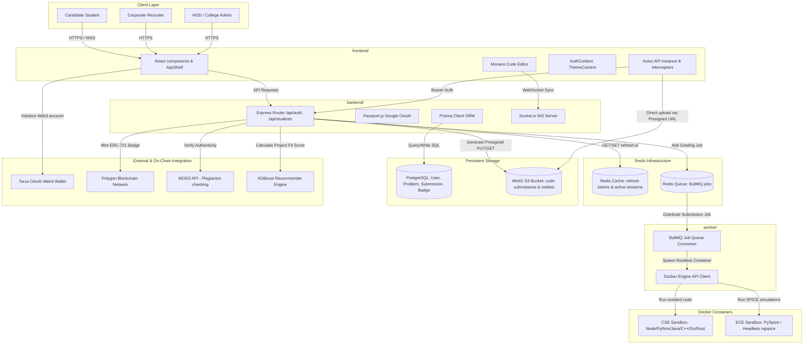

# System Architecture & Technical Specifications

This document outlines the system architecture of the TalentForge platform. It maps workspaces, boundaries, data queues, object storage layers, and third-party Web3 integrations.

---

## 🏗️ Block Diagram

The diagram below details the execution spaces of the monorepo workspaces and how background job workers communicate with isolator sandbox containers.



---

## ⚙️ Core Architecture Workspaces

### 1. Unified Client Interface (`frontend/`)
* **Monaco Editor Integration:** Embedded VS Code-like coding interface loaded with Python, Java, C++, JS, Go, and Rust boilerplate models.
* **Auto-refresh Queue:** Intercepts `401 Unauthorized` responses and schedules credentials updates via a cached refresh token queue.
* **PlayStation Styling:** Alternating pitch black, pure white, and brand blue chapters featuring a smooth Hero slideshow.

### 2. API Gateway & Controllers (`backend/`)
* **Prisma Engine:** Integrates relational PostgreSQL modeling with strict one-to-one and one-to-many cascading schemas.
* **Passport OAuth:** Strategies managing student registration, JWT tokens generation, and profile defaults.
* **Redis Store:** Encapsulates refresh tokens in Redis using standard TTL values (`refresh:{id} EX 604800`).

### 3. Asynchronous Job Worker (`worker/`)
* **BullMQ Queue Management:** Listens to incoming job states, spawns isolator docker runtimes, and processes submissions out-of-band.
* **Sandbox Isolation:** Spawns sandbox containers running with network access disabled (`network_disabled=true`), rootless seccomp configurations, and memory locks capped at 256MB.

---

## 🔄 Assessment Lifecycle Dataflow

The flow diagram below traces a student submission from code edit to blockchain badge issuance:

```
[Write Code in Monaco]
       │
       ▼
[Direct upload code script to MinIO Bucket via S3 Presigned URL]
       │
       ▼
[Express Server receives metadata ➔ creates database record in PostgreSQL]
       │
       ▼
[Express Server enqueues grading task into BullMQ Queue]
       │
       ▼
[Sandbox Worker picks up job ➔ downloads code script from MinIO]
       │
       ▼
[Worker spawns isolated Docker Container ➔ Runs code with strict timeouts]
       │
       ▼
[Code autograded ➔ standard output & complexity reports parsed]
       │
       ▼
[Live Socket.io push en route to candidate frontend dashboard]
       │
       ▼
[Human Reviewer logs approval rating (expert verification overrides)]
       │
       ▼
[Express Server triggers Polygon contract minting standard ERC-721 badge]
```
