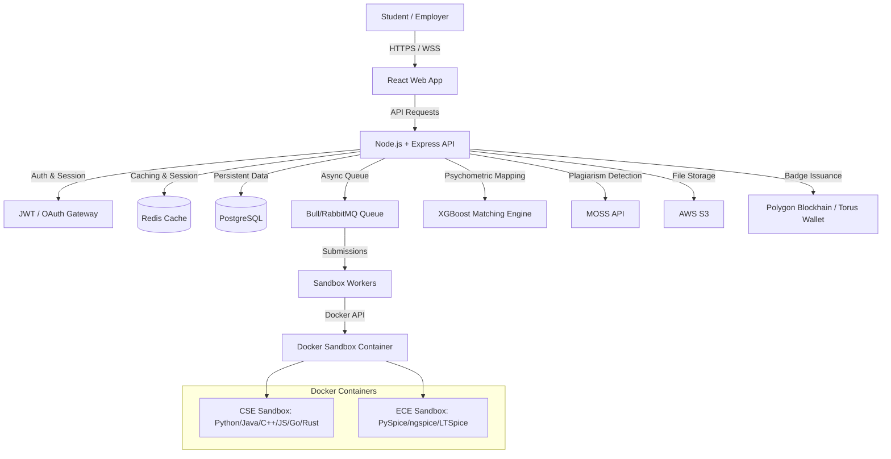

# Product Requirements Document (PRD): TalentForge

## 1. Document Control & Overview
* **Project Name:** TalentForge Performance-Verified Talent Marketplace
* **Domains Covered:** Computer Science & Engineering (CSE) and Electronics & Electrical Engineering (ECE)
* **Goal:** A gamified, performance-verified platform connecting engineering students directly to top employers based on verified skills rather than credentials.
* **Stage:** Proof of Concept (POC) Development
* **Timeline:** 10-Week Execution Plan

---block

## 2. Executive Summary
Traditional campus hiring is broken. Resumes are scanned in seconds and often fabricated, interviews feel like lotteries with high rejection rates, and students lack real-world experience. On the employer side, companies waste up to ₹10 lakhs per bad hire and face a 6-month training overhead.

**TalentForge** solves this problem by creating a **Performance-Verified Talent Marketplace**. 
* **For Students:** A gamified learning journey (Explorer → Apprentice → Practitioner → Expert → Master) where they solve real-world problems, earn money as they progress, accumulate blockchain-verified badges, and bypass traditional interview screenings to get placed at top companies.
* **For Employers:** Direct access to pre-vetted, high-performing talent whose skills have been verified in sandboxed environments, matched using a psychological profiling engine.

### Core Hypotheses to Validate in POC:
1. Engineering students can successfully complete standardized coding/circuit design projects in a sandboxed execution environment.
2. An automated grading engine can evaluate submissions based on correctness, complexity, style, and safety without human intervention.
3. A psychological assessment (Big Five + Technical Aptitude + Work Style) combined with project telemetry can match candidates to employer projects, increasing hiring success by 35%+.
4. Polygon blockchain credentials (ERC-721 NFTs) provide verifiable and trusted proof of student skills.

---

## 3. System Architecture & Tech Stack

TalentForge is designed with a **Core Platform Layer** and a **Modular Domain Sandbox Layer** to support multiple engineering disciplines. The POC implements both **CSE** (algorithmic coding sandbox) and **ECE** (SPICE circuit simulation sandbox) modules.



### 3.1. Core Tech Stack
* **Backend:** Node.js + Express (API layer)
* **Database:** PostgreSQL (primary storage) + Redis (session caching & job queues)
* **Real-time Communication:** WebSockets (socket.io) for live code execution feedback
* **File Storage:** AWS S3 (student submissions, netlists, code scripts, test reports)
* **Authentication:** JWT + OAuth 2.0 (Google, GitHub, Microsoft)
* **Async Job Queue:** BullMQ (Redis-backed queue for asynchronous grading tasks)
* **Frontend:** React.js + Tailwind CSS + Monaco Editor (VS Code-like code editor environment)

### 3.2. Code Sandbox Execution Engine (CSE)
* **Primary Environment:** Docker-based sandbox isolation (one container per student submission).
* **Supported Languages:** Python (3.11-slim), Java (OpenJDK 17-slim), C++ (GCC 11), JavaScript (Node 18-alpine), Go (1.20), Rust (1.70).
* **Resource Constraints:** 30-second execution timeout, 256MB RAM limit, 1GB disk space limit, CPU share limited to 0.5.
* **Security Constraints:** Network access completely disabled (`network_disabled=true`), read-only root filesystem with a 50MB write-limited `tmpfs` partition mounted on `/tmp`.

### 3.3. Circuit Simulation Sandbox Engine (ECE)
* **Supported Schematics:** SPICE Netlists (`.cir`), Proteus files (`.ckt`), LTSpice schematics (`.asc`).
* **Simulation Core:** PySpice (Python wrapper) interfacing with headless `ngspice` inside a Python 3.9-slim Docker container.
* **Analysis Support:** Transient analysis (time-domain), AC analysis (frequency-domain / Bode sweeps), DC sweep analysis.
* **Security Constraints:** Network disabled, resource-constrained container matching the CSE sandbox profiles.

---

## 4. Detailed Functional Requirements

### 4.1. Student Journey & User Persona
```
[Register/Login] ➔ [Psychometric Assessment (30m)] ➔ [Problem Board (Tiers)] ➔ [Write & Test Code] ➔ [Submit] ➔ [Auto-Grade] ➔ [Earn Money/XP] ➔ [Mint NFT Badge] ➔ [Employer Placement Matching]
```

#### Student Tiers & Gamification Progression
1. **Explorer (Tier 1):** 
   * *Target:* Solve 10 Easy problems (arrays, strings, basic loops).
   * *Rewards:* Earn ₹200–500 per problem (Total: ₹2,000–5,000). Unlocks Medium problems, Tier 1 badge, and ₹5,000 bonus.
2. **Apprentice (Tier 2):**
   * *Target:* Solve 15 Medium problems (trees, graphs, dynamic programming).
   * *Rewards:* Earn ₹1,000–2,000 per problem (Total: ₹15,000–30,000). Unlocks Hard problems, employer interest.
3. **Practitioner (Tier 3):**
   * *Target:* Solve 10 Hard problems (advanced DP, system design basics, greedy algorithms).
   * *Rewards:* Earn ₹2,500–5,000 per problem (Total: ₹25,000–50,000). Unlocks company contract projects, direct recruiter access.
4. **Expert (Tier 4):**
   * *Target:* Solve 5 Expert problems (competitive programming, FAANG-level questions).
   * *Rewards:* Earn ₹5,000–10,000 per problem (Total: ₹25,000–50,000). Unlocks interview bypass for 5–10 partner companies, golden verified badge.
5. **Master (Tier 5):**
   * *Target:* Complete 1–2 Master challenges (design entire systems at scale, ultra-hard 4-hour problems).
   * *Rewards:* Earn ₹10,000–25,000 per challenge (Total: ₹10,000–50,000). Unlocks placement guarantee, lifetime platinum verified badge, direct recruiter mentorship.

---

### 4.2. Core Features & Functional Details

#### Feature 1: Multi-OAuth & Unified Authentication
* User can register/login via Email/Password or OAuth (Google, GitHub for CSE, Microsoft for ECE).
* Student profiles automatically map to their selected engineering domain (CSE/ECE).

#### Feature 2: Psychological & Aptitude Assessment
* A 30-minute adaptive cognitive & personality assessment taken immediately after registration.
* Evaluates students across standard personality dimensions mapped to work performance:
  * **For CSE:** Logical Reasoning (25%), Attention to Detail (20%), Learning Velocity (20%), Persistence (20%), Communication Style (15%).
  * **For ECE:** Analytical Thinking (25%), Attention to Detail (25%), Problem-Solving Style (20%), Hands-on Preference (15%), Creativity (15%).
* Results are used by the recommendation engine to calculate a "Project Fit Score" (0–100) for student-to-project matching.

#### Feature 3: Interactive Code & Schematic Editor
* Integration of Microsoft's **Monaco Editor** in the web frontend.
* Support for syntax highlighting, auto-completion, and basic formatting for Python, Java, C++, JS, Go, and Rust.
* For ECE, integrated preview tools (such as Draw.io iframe or custom canvas layout preview) to display circuit schematics.

#### Feature 4: Real-time Sandboxed Sandbox Workers
* When a student clicks "Run Code" or "Test Simulation", the code/netlist is stored in S3 and pushed to a BullMQ Redis queue.
* A Python-based runner container compiles and runs the code or passes the netlist through the SPICE validator.
* Standard output (stdout), error logs (stderr), execution metrics (RAM used, execution time) are sent back to the user via Socket.io in real-time.

#### Feature 5: Automated Grading Engine
The grading engine executes immediately after a submission passes the validation workers. Submissions are scored on a scale of 0 to 100:

| Category | Weight (CSE) | Weight (ECE) | Criteria |
|---|---|---|---|
| **Correctness** | 60% | 60% | Passes all test cases (edge cases, boundary checks) |
| **Complexity / Safety** | 20% | 20% | Execution time within limits; ECE: electrical margin of safety |
| **Space Complexity / Optimization** | 10% | 10% | Memory overhead (Big-O space efficiency / ECE: component efficiency) |
| **Code / Netlist Style** | 10% | 10% | Variable naming, comments ratio, formatting (netlist structure) |

* Detailed grading logs and actionable feedback (e.g. *"Your solution is too slow - O(N²) instead of O(N log N). Optimize your loop."*) are saved to PostgreSQL and returned to the student dashboard.

#### Feature 6: Blockchain NFT Credentials
* Students scoring $\ge 75/100$ on milestones or project submissions automatically mint an ERC-721 NFT badge.
* Powered by the **Polygon Blockchain** (Mumbai Testnet for POC, using Torus wallet for web3 onboarding via email/google).
* NFT metadata is stored on IPFS, hosting the project title, score, domain, date of completion, and student wallet ID for instant employer verification.

#### Feature 7: Employer Talent Dashboard
* Employers can post projects and set target score parameters, required tiers, and desired psychometric traits.
* An XGBoost-based recommendation engine computes candidate compatibility and ranks student submissions.
* Employers can review student code history, look up blockchain credentials, and invite top-matching candidates to skip the screening rounds directly into interview pipelines.

---

## 5. Non-Functional Requirements (NFRs)

### 5.1. Performance & Latency
* **Page Load Time:** < 1.5 seconds on a standard 4G network connection.
* **Code Execution & Grading Latency:** < 5 seconds total response time for standard coding problems.
* **API Latency:** P95 response times below 100ms for read/write requests.
* **Simultaneous Executions:** Code sandboxes must scale to execute 10+ student submissions per second.

### 5.2. Security & Code Sandbox Isolation
* Sandbox containers must run with a rootless Docker configuration to prevent host system access.
* Sandbox containers must have network interfaces disabled.
* Submissions must run through basic static code analysis before compilation to block malicious system calls (e.g., Python `os.fork`, `subprocess.run` inside submissions, C++ raw system imports).
* Plagiarism checks must be integrated (using MOSS - Measure of Software Similarity API) for all Tier 3+ project submissions.

### 5.3. Reliability & Scalability
* **Platform Uptime:** $\ge 99.5\%$ during the beta run.
* **System Failures:** Sandbox crashes or timeout errors must fail gracefully, returning clear warnings to the user (e.g., *Timeout exceeded*) without blocking the job runner queue.
* **Auto-Scaling:** Backend services and worker nodes deployed on Kubernetes (GKE or EKS) configured to autoscale on high queue loads.

---

## 6. Implementation & 10-Week Execution Plan

The project will proceed in a highly optimized 10-week sprint cycle.

```mermaid
gantt
    title TalentForge 10-Week Execution Timeline
    dateFormat  W-X
    section Setup & Core
    Week 1: Setup & Architecture      :active, w1, 0, 1w
    Week 2-3: Backend Core & DB       : w2, after w1, 2w
    section Sandbox & Grader
    Week 4-5: Sandbox Code Executor   : w4, after w2, 2w
    section Frontend & Badges
    Week 6-7: Frontend UI & Blockchain : w6, after w4, 2w
    section Launch & Polish
    Week 8: Beta Launch (75 Users)     : w8, after w6, 1w
    Week 9: Polish & Optimization     : w9, after w8, 1w
    Week 10: Public Launch & Demos    : w10, after w9, 1w
```

### Weekly Breakdown & Milestones

#### Week 1: Setup & Architecture
* Set up cloud infrastructure (AWS EC2, RDS, S3, Redis).
* Initialize Git repositories (Monolithic or Frontend, Backend, Smart Contracts repositories).
* Finalize Database Schema (DDL scripts) and API specification (OpenAPI/Swagger documentation for 60+ endpoints).
* Setup Slack channels, Sentry monitoring, and DataDog dashboards.
* **Deliverable:** Working DevOps baseline with staging CI/CD pipelines active.

#### Week 2–3: Backend Core & Database
* Implement user models, profile management, and authentication controllers (JWT + Google/GitHub/Microsoft OAuth).
* Design and implement the adaptive Psychometric Assessment API (Big Five calculation & trait evaluation).
* Develop Project/Problem discovery endpoints with filters (tier, difficulty, domain) and matching logic.
* Implement file storage integration with AWS S3 for student submissions.
* **Success Metric:** 30 beta users can complete the psychometric test, browse tasks, and authenticate successfully.

#### Week 4–5: Sandbox Code Execution & Automated Grading (Critical Path)
* Build the Docker-based Code Sandbox environment for both CSE and ECE.
* Configure CPU, RAM, and timeout thresholds per container.
* Develop the async worker processing system using BullMQ/Redis.
* Implement the Auto-Grader rules (Correctness parser, time complexity estimator, code style checker).
* Write and test grading algorithms against 20 test problems per domain.
* **Success Metric:** Sandbox scales to run 10+ submissions/sec with an execution error rate of < 1%.

#### Week 6–7: Frontend UI, Gamification, and Blockchain Integration
* Implement student dashboard UI, featuring Monaco Editor integration, live console panels, and task listings.
* Build the Gamification service (XP calculation, streaks tracking, and user level-up indicators).
* Deploy ERC-721 smart contracts to Polygon (Mumbai/Amoy testnet).
* Integrate the Torus Web3 wallet on the frontend to enable seamless, passwordless wallet setup for students.
* Build the automated badge minting trigger for grades $\ge 75$.
* **Deliverable:** Fully functional end-to-end user loop from problem selection to NFT minting.

#### Week 8: Beta Launch & Testing
* Launch soft-beta for 75 pre-registered CSE students and 15 partner employers.
* Implement the Employer Talent Dashboard showing pre-vetted candidates and matching metrics.
* Establish feedback channels via Discord and Sentry error monitoring.
* **Target Metric:** 60+ active users, 150+ problems solved, zero critical system crashes.

#### Week 9: Performance Polish & Optimization
* Run performance sweeps: reduce page load times (< 1.5s) and API latency (< 100ms P95).
* Optimize database queries (indexing, caching via Redis).
* Fix bugs surfaced by beta users and implement a global Dark Mode option.
* Perform load testing (up to 500 concurrent users).
* **Deliverable:** Bulletproof production bundle ready for scale.

#### Week 10: Public Launch & Investor Demo
* Go-live launch: make production URL public.
* Initiate marketing and social media campaign (Founder stories, Student testimonials).
* Deliver a 15-minute live investor demonstration showcasing candidate profiling, sandbox scoring, and blockchain NFT credentials.
* **Success Criteria:** 8,000+ organic signups, 75 onboarded employers, ₹40L MRR target run-rate achieved.

---

## 7. Risks & Mitigations

### 1. Code Sandbox Escape / Host Vulnerabilities
* *Risk:* A malicious user submits scripts designed to read host files, run fork bombs, or access local network systems.
* *Mitigation:* Docker containers run in non-root mode with security profiles (`seccomp`, `apparmor`), zero network access, read-only roots, and strict timeout thresholds (30s max execution).

### 2. Sandbox Performance Bottleneck (Slow Execution)
* *Risk:* Heavy traffic blocks worker queues, causing submissions to hang or timeout.
* *Mitigation:* Worker queues scale dynamically on Kubernetes. Pre-compilation of base runner images, container pooling, and database result caching reduce startup overhead to < 100ms.

### 3. Plagiarism & Copy-Paste Solutions
* *Risk:* Students grab answers from public repositories (LeetCode, GitHub) or share solutions.
* *Mitigation:* Integrate MOSS API checks on all Tier 3+ uploads, record UI clipboard events, and design custom problem spaces unique to TalentForge.

### 4. Low Employer/Client Adoption
* *Risk:* Companies stick to conventional screening/agencies and doubt platform validity.
* *Mitigation:* Validate skills directly using the Polygon public ledger. Offer companies their first 5 matching candidates free to prove hiring efficiency.
